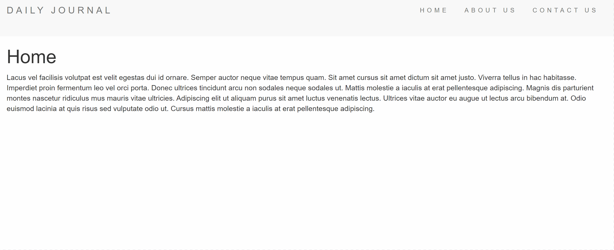
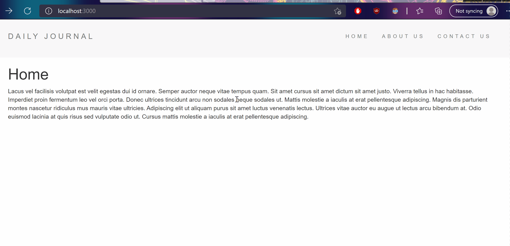

# A Blog Template
This is a simple template useful for someone who is looking to start their own blog. The script is written in ES6 JS.

A live version featuring Lorem Ipsum script is available HERE (Link to be added soon).

If you want to download the file to get a more in-depth look at the Blog Template, read on below. This is not required as the app is hosted at the provide weblink above for quick viewing.

## Setup
1. Download the latest version of node.js for your Operating System.
2. Next, download the latest version of Nodemon.
    * This can be used to auto restart the application.
3. Run npm install inside the blog-files folder from the command line.
4. To run the application enter into the command line interface (CLI):

    ```
    nodemon app.js
    ```
## Display
If the application is running successfully, the CLI will display:
```bash
Server is running on port 3000
```

You can then type localhost:3000 into your browser of choice. You should see the screen below.
<p align="center"></p>

## How To Add Blog Entries
* At the end of your URL type "/compose." For example localhost:3000/compose.
* You will be brought to a page to write an entry.
* Publish the entry which will be displayed on the main page. You can read the entire article by clicking "Read More."

<p align="center"></p>
